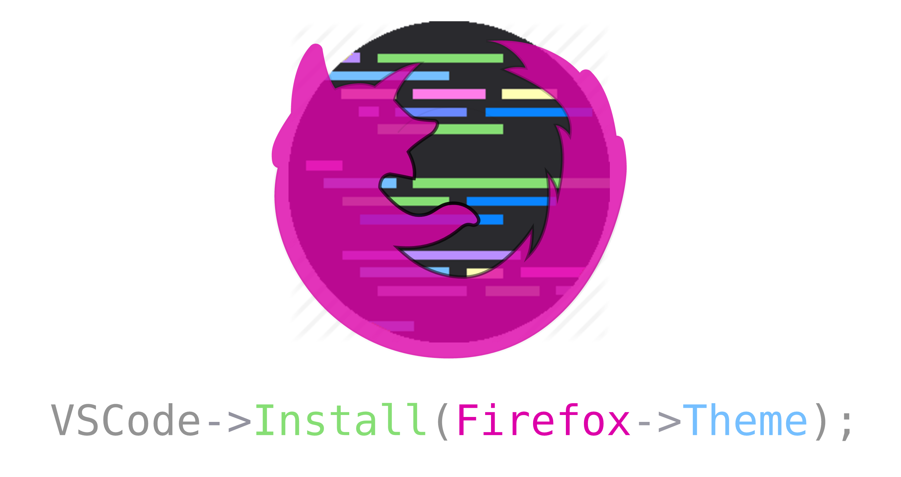

# Firefox Theme NG for VS Code

A VS Code color theme inspired by Firefox's [browser chrome](https://developer.mozilla.org/en-US/docs/Glossary/Chrome) — not just DevTools, but the full UI palette you see every day. Colors are extracted directly from Firefox's built-in theme definitions.

## Themes

- **Firefox Dark NG** — The signature Firefox dark palette: deep purples, cool grays, and vivid accent blues
- **Firefox Light NG** — A clean, airy counterpart with Firefox's native light-mode tones

## Installation

### From [Marketplace](https://marketplace.visualstudio.com/items?itemName=tenkirin.firefox-theme-ng)

Search for "Firefox Theme NG" in the VS Code Extensions view (`Ctrl+Shift+X`).

## Development / Preview

1. Open this repository in VS Code
2. Press `F5` to launch the Extension Development Host
3. In the new window, press `Ctrl+K Ctrl+T` to open the Color Theme picker
4. Select "Firefox Dark NG" or "Firefox Light NG"

## Color Sources

Firefox Theme NG uses two source layers from Firefox's `omni.ja` assets:

| Theme Layer           | Firefox Source                                                                     |
| --------------------- | ---------------------------------------------------------------------------------- |
| Workbench / UI colors | `omni/chrome/browser/skin/classic/browser/browser-colors.css` and `browser.css`    |
| Syntax / token colors | `omni/chrome/devtools/skin/variables.css`, `light-theme.css`, and `dark-theme.css` |

## Credits

- Original [Firefox Theme](https://github.com/firefox-theme/visual-studio-code) (MIT License)
- Color values derived from Firefox (MPL 2.0). No MPL-licensed source code is included in this distribution

## License

[MIT](LICENSE)
